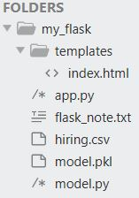
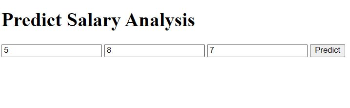
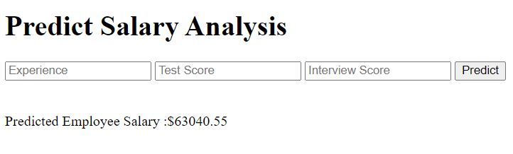

# Learning-Flask-with-simple-Hiring-Dataset
This is a learning demo project for learning Flask and its use. Basic Information of flask and its different requirements will be also mentioned.
 
Flask-  
web application framework
  
Pickle module- 
It is used for serialization and de-serialization a python object. 
It serializes a object(list, dict) before writing to file.
  
<b>File Hierarchy</b> 

  
<b>3 steps towards using Flask-</b> 
<b>1. Loading saved model and Initializing Flask app</b> 
Firstly, code of building a simple regression model and then saving the model by serializing it using pickle. 
<b>model.py</b> - The Machine Learning model to predict employee salaries based on training data according to ‘hiring.csv’ file.
  
<b>2. Redirecting API to home page</b> 
<b>app.py</b> -  File with Flask APIs that receives employee details through GUI/API calls, computes the predicted value based on given model and returns it. 
<b>templates</b> - This folder contains the HTML template (index.html) i.e., home page before and after predict. 
<b>index.html</b> - The html file of home page which redirects. 
<b>Redirecting to home page</b> 

 
app = Flask(__name__) - takes current module as argument to Flask constructor 
app.run() - method of Flask class that runs the application on the local development server.  
@app.route('/') - ‘/’ URL is bound with a function mentioned. 
The route() function of the Flask class is a decorator, which tells the application which URL should call the associated function.
  
<b>3. Redirecting API to predict result</b>
<b>Redirecting to predict</b> 

  
